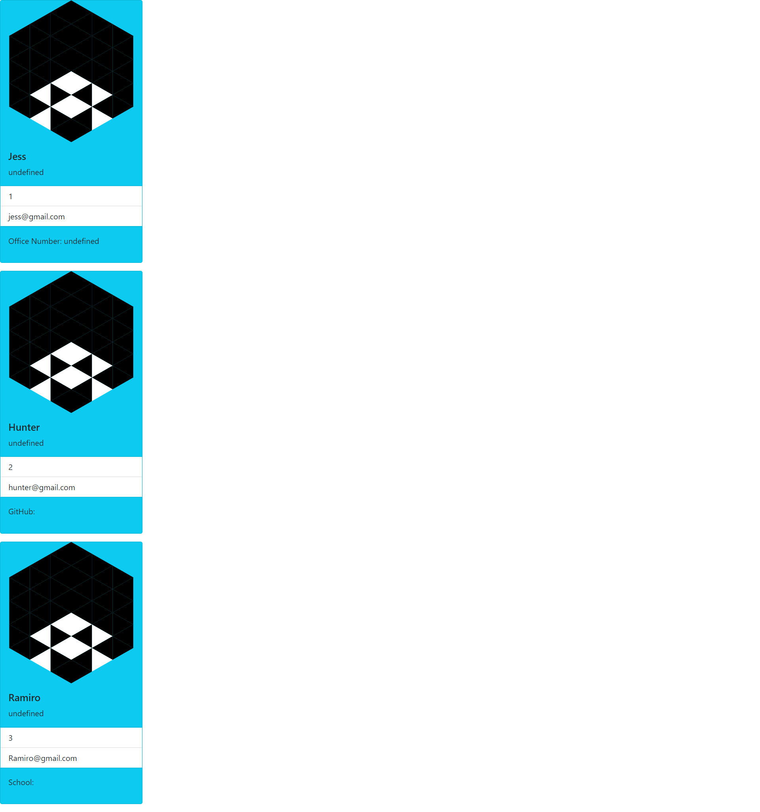

# SummaryGenerator

Project Goal: 
Our challenge is to build a Node.js command-line application that takes in information about employees on a software engineering team and generates an HTML webpage that displays summaries for each person. Because testing is key to making code maintainable, I'll also be writing unit tests for each part of your code and ensure that it passes all of them.

Technologies Used: 
* HTML 
* CSS
* Bootstrap
* Javascript
* Node.js

 https://trayehunter1.github.io/SummaryGenerator/
 
 

